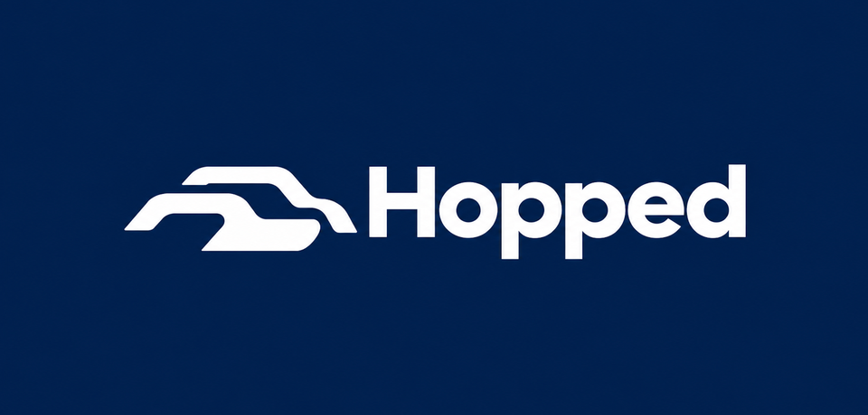
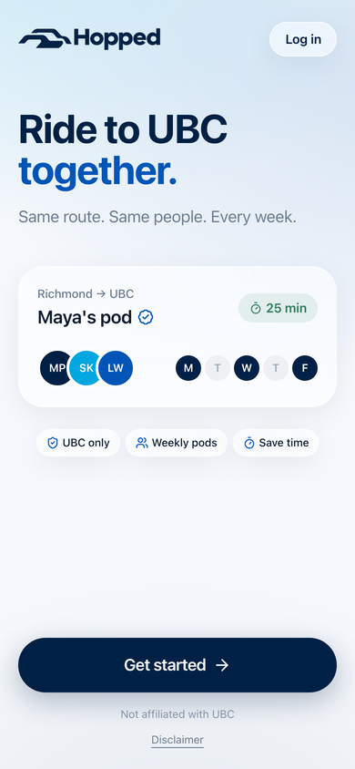
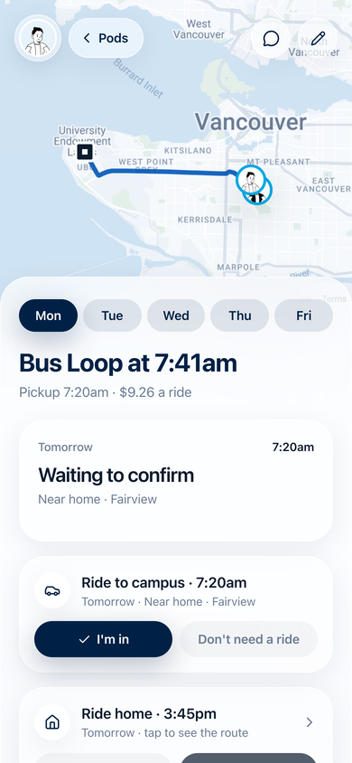
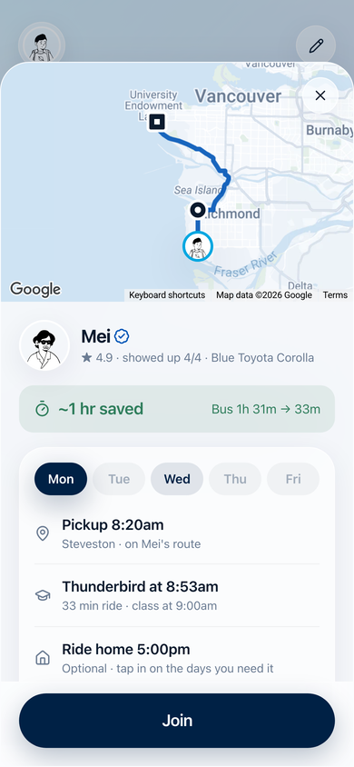
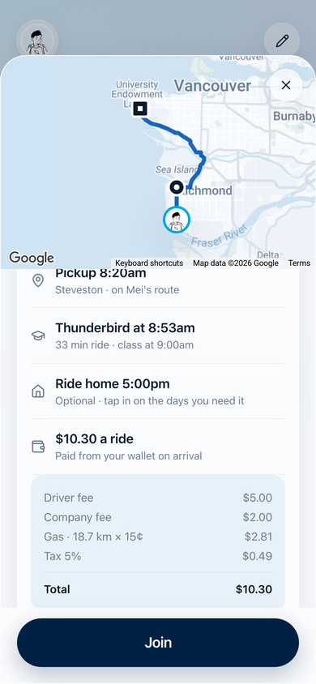
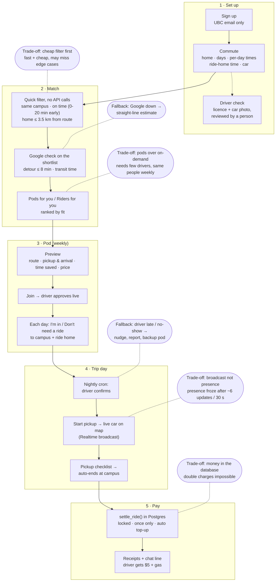

<p align="center">
  
</p>

<p align="center">
  <b>Carpool to UBC with the same small group every week.</b><br>
  Built for HelloHacks 2026.
</p>

<p align="center">
  <a href="https://www.loom.com/share/de6ba407dc1f4b759d7bcbfacc757096"><b>▶ Watch the demo (Loom)</b></a>
  &nbsp;·&nbsp;
  <a href="https://hellohacks-coral.vercel.app"><b>Try it live</b></a>
</p>

<p align="center">
  <a href="#system-at-a-glance">System at a glance</a> ·
  <a href="docs/ARCHITECTURE.md">Architecture</a> ·
  <a href="docs/ARCHITECTURE.md#edge-cases-and-fallbacks">Edge cases</a> ·
  <a href="docs/ARCHITECTURE.md#trade-offs">Trade-offs</a> ·
  <a href="#run-it-locally">Run it</a>
</p>

---

## What it is

Getting to UBC by bus can take over an hour each way. Uber costs about $27. Most students driving to campus have empty seats.

**Hopped matches commuters into pods**: a verified student driver plus a few riders who live along the route and need to be on campus at the same time. The same people ride together every week, so it's predictable and it's safer than riding with strangers.

<p align="center">
  
  
  
  
</p>

## How it works

**Drivers** say where they live, which days they drive, when they need to be on campus (per day), when they head home, and add their car. Hopped fills their empty seats with riders on their way.

**Riders** set the same things and get **pods for you**, ranked by fit. Before joining they can preview everything:
- the exact route through every pickup, and their own pickup and arrival time for each day
- how much time they save vs transit (e.g. *~1 hr saved: bus 1h 31m → 33m*)
- the price, itemised up front (e.g. **$9.24** vs about $27 on Uber)

Then, week to week:
- **Per-day choices:** for each weekday, *I'm in* or *Don't need a ride*, for the ride to campus and the ride home.
- **Live trips:** the driver taps *Start pickup*, riders watch the car on the map, get "Alex is here", and the trip ends by itself on arrival.
- **Automatic payment:** the rider's wallet is charged when the trip ends and the driver is paid. Nobody owes anyone. *(Demo money for now; see below.)*
- **Pod chat, notifications, ratings, reliability** ("showed up 14/14"), **pause driving** (riders keep their spots for 7 days), and a **commuter directory** to find people directly.

## System at a glance

The whole flow in one picture: what happens at each step, the main design choice behind it, and what happens when something goes wrong. The full write-up (data model, matching, trip day, payments, live location, privacy, every edge case) is in **[docs/ARCHITECTURE.md](docs/ARCHITECTURE.md)**.



## Pricing

Per rider, per ride: **$5 driver fee + $2 company fee + $0.15/km gas + 5% tax**. The driver receives the driver fee and the gas.

## Features

| | |
|---|---|
| **Matching** | Route-aware: rider within 3.5 km of the driver's route, detour ≤ 8 min, driver arrives 0–20 min before the rider needs to. Pickups on the route become walk-to spots. Transit comparison via Google Directions. |
| **Pods** | Multiple pods per rider (different days), driver approval, invites, per-day times, ride home opt-in, pause/resume, backup pods. |
| **Trips** | Live location over Supabase Realtime broadcast, pickup checklist, auto-complete on arrival, receipts and ratings. |
| **Wallet (demo)** | Ledger in Postgres. Charges run inside a single locked database function: all or nothing, at most once per ride, with auto top-up so balances never go negative. Top-ups and cash-outs are idempotent. |
| **Trust** | UBC email sign-up, driver licence + car photo reviewed by a person (`/admin`), neighbourhood-only locations, message reporting. |
| **Notifications** | Web push (installable PWA) with email fallback. |

## Tech

Next.js 14 (App Router) · TypeScript · Tailwind · Supabase (Auth, Postgres + RLS, Realtime, Storage) · Google Maps Platform (Maps JS, Directions, Places) · Vercel (hosting + nightly cron) · Playwright + ffmpeg (demo video tooling).

## Run it locally

```bash
npm install
cp .env.example .env.local        # fill in Supabase + Google Maps keys
npx supabase db push              # apply migrations in supabase/migrations
npm run dev                       # http://localhost:3000
```

Locally, the verify screen has a **Skip verification (dev only)** button so you don't need a real inbox.

### Demo data

```bash
npm run seed:pods        # ~150 demo commuters matched into pods
npm run seed:demo-pods   # hand-made pods covering edge cases (per-day times, partial days, one-day pods)
npm run seed:wallets     # payment history for the demo pods
```

Demo users have no login and never receive email or push.

### Demo video

```bash
npm run build
npm run demo:record      # drives the real app in two phone-sized browsers (driver + rider)
npm run demo:edit        # cuts it into out/demo/Hopped-demo.mp4
npm run demo:screens     # phone screenshots for slides → out/deck/
```

The recording runs the real app end to end. Three things are stood in for, only in that local run: the verification email link, the clock (it's set to a Monday morning), and GPS (the driver's browser is fed points along the real route).

## Project layout

```
src/app/            pages + API routes (pods, trips, wallet, admin, cron)
src/components/     UI (pods, trip, wallet, onboarding)
src/lib/pods/       matching engine, trips, time helpers
src/lib/wallet.ts   demo wallet (calls the settle_ride database function)
supabase/migrations database schema, RLS and functions
scripts/            seed data + demo video tooling
```

## Notes

- **Payments are demo money.** The wallet, top-ups, charges and cash-outs all work end to end, but no real money moves. Real payouts would use a payment provider.
- Hopped is an independent student project and is not affiliated with the University of British Columbia.

Built by the Hopped team at HelloHacks 2026.
