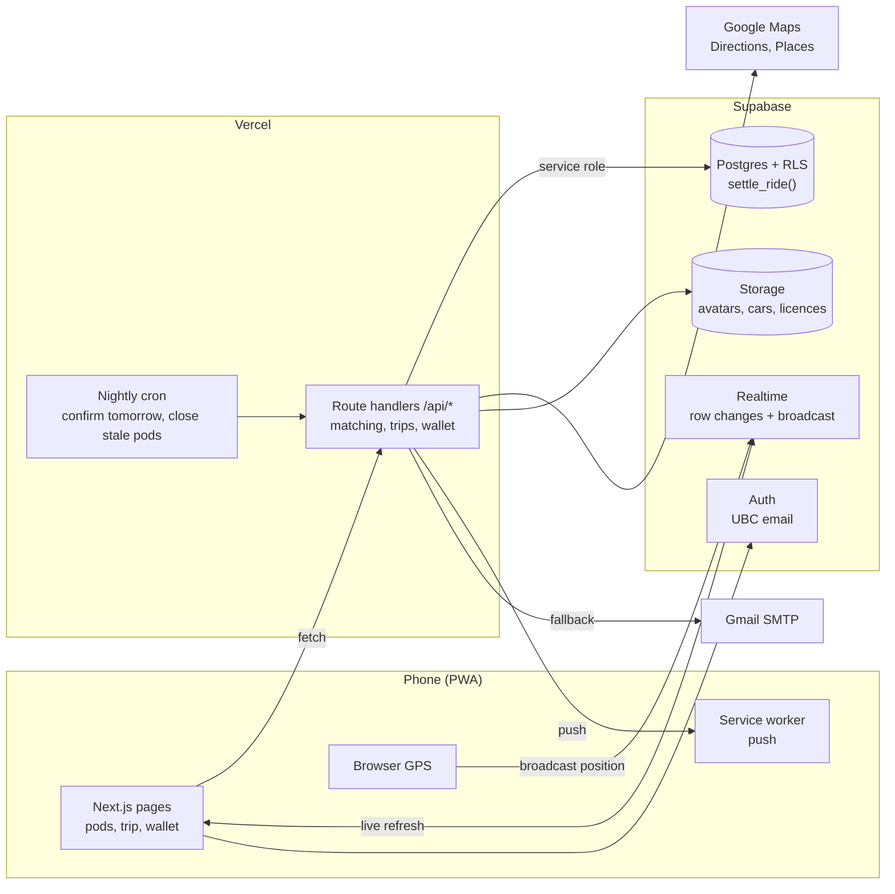
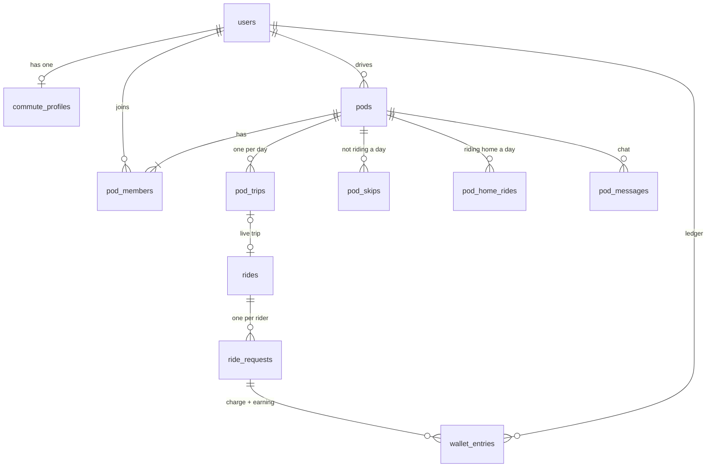
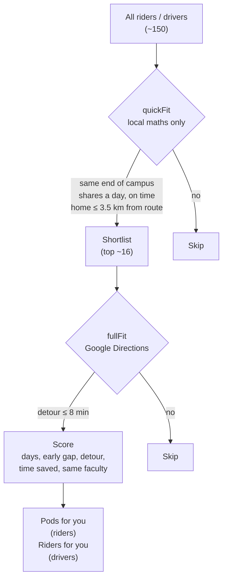
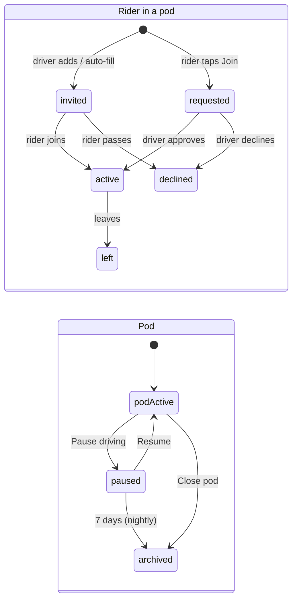
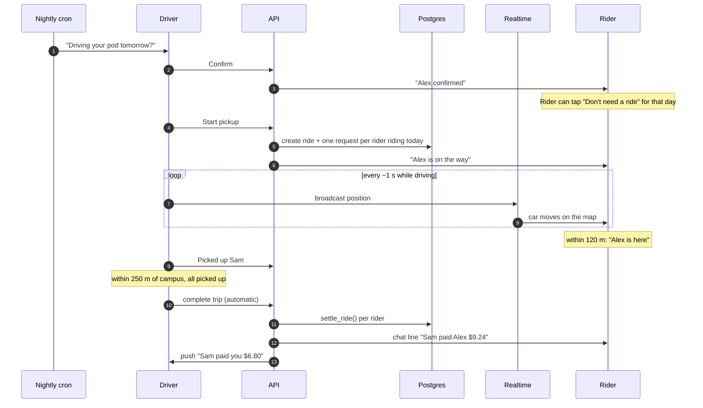
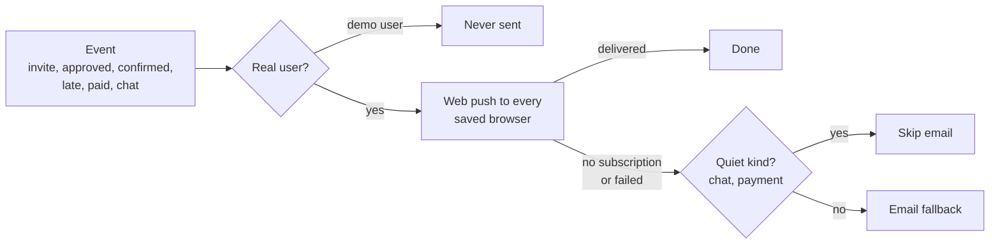

# Hopped: architecture

How the system is put together, why it's built that way, and what happens when things go wrong.

[System](#system) · [Data model](#data-model) · [Matching](#matching) · [Pod lifecycle](#pod-lifecycle) · [A day in a pod](#a-day-in-a-pod) · [Payments](#payments) · [Live location](#live-location) · [Time](#time) · [Privacy and trust](#privacy-and-trust) · [Notifications](#notifications) · [Edge cases and fallbacks](#edge-cases-and-fallbacks) · [Trade-offs](#trade-offs)

---

## System



One Next.js app is both the UI and the API. Every write goes through a route handler with the service-role key, so the rules live in one place (TypeScript plus a few Postgres functions). The browser only talks to Supabase directly for sign-in and Realtime.

---

## Data model



| Table | What it holds |
|---|---|
| `commute_profiles` | Home, campus spot, days, arrival time (+ per-day overrides), ride-home leave time, seats, cached route polyline |
| `pods` | One per driver: `active`, `paused` or `archived` |
| `pod_members` | Rider in a pod: status, which days, pickup spot + time, detour, drive vs transit minutes |
| `pod_trips` | One row per pod per date: `scheduled → confirmed → live → completed`, or `cancelled` / `missed` |
| `rides`, `ride_requests` | The live trip (reused by the trip screen, tracking and ratings) |
| `pod_skips`, `pod_home_rides` | Per-day choices: "Don't need a ride" to campus, "I'm in" for the ride home |
| `wallet_entries` | The ledger. Balance = sum of a user's rows |

---

## Matching

The expensive part of matching is Google (driving detours, transit times). The design is **cheap filter first, expensive check only for the few that survive**.



The first pass costs nothing (distance to a cached route polyline). The second pass makes 2 to 3 Google calls per candidate, so it only runs on the shortlist.

```ts
// src/lib/pods/match.ts
function quickFit(d: Profile, r: Profile, path: LatLng[]) {
  if (d.user_id === r.user_id) return null;
  if (haversineKm(campus(d), campus(r)) > 2) return null;      // different end of campus
  const { days, avgGap } = sharedDays(d, r);                    // driver arrives 0-20 min before rider
  if (!days.length) return null;
  const near = closestPointOnPath(home(r), path);               // distance to the driver's route
  if (near.km > MAX_ROUTE_DISTANCE_KM) return null;             // 3.5 km
  return { days, avgGap, near };
}
```

| Rule | Value | Why |
|---|---|---|
| Driver arrives before rider needs to | 0 to 20 min early | Never late; not stuck waiting 45 min |
| Rider home to driver's route | ≤ 3.5 km | Keeps the Google check to real candidates |
| Pickup on the route | ≤ 0.8 km | Rider walks to a spot on the route instead of a detour |
| Extra driving for the driver | ≤ 8 min | Drivers stay willing |
| Score | days × 10, + early-gap, detour, time saved, same faculty | More shared days matter most |

**Riders can be in several pods** (Mon/Wed with one driver, Tue/Thu with another). Days already covered by another pod are removed before matching, so nobody is double-booked.

---

## Pod lifecycle



- **Demo riders and drivers join instantly** (they have no login, so they can't tap buttons). Real people always choose.
- **Pausing keeps everyone's spot.** Riders can join a backup pod for those days. On resume, anyone who found another pod for all their days is released, so nobody ends up in two pods for the same day.
- **Closing a pod** moves every rider back into matching and tells them.

---

## A day in a pod



The pod trip reuses the same `rides` / `ride_requests` tables as the live trip screen, so tracking, the pickup checklist, receipts and ratings are one code path.

---

## Payments

Demo money, real mechanics. Every ride is **$5 driver fee + $2 company fee + $0.15/km gas + 5% tax**. The driver gets the driver fee and the gas.

The charge happens **inside Postgres**, in one function, so it can't half-happen or happen twice:

```sql
-- supabase/migrations/20261002000100_wallet_settle_order.sql (trimmed)
create or replace function settle_ride(p_request uuid, p_driver_share int, p_topup_step int, p_card text)
returns table (charged boolean, amount int, topped_up int) language plpgsql as $$
begin
  select ... into r from ride_requests rr join rides ri on ri.id = rr.ride_id
   where rr.id = p_request
     for update of rr;                                    -- 1. lock this ride

  if exists (select 1 from wallet_entries
             where request_id = p_request and kind = 'ride') then
    return query select false, r.cents, 0; return;        -- 2. already paid
  end if;

  if balance < r.cents then                               -- 3. never owe: auto top-up
    insert into wallet_entries (... 'topup', 'auto:' || p_request);
  end if;

  insert into wallet_entries (...) values                 -- 4. charge + earning together
    (rider,  -r.cents,       'ride',    p_request, ...),
    (driver, p_driver_share, 'earning', p_request, ...);
end $$;
```

| Guarantee | How |
|---|---|
| A ride is charged once | Row lock + "already paid" check + unique index on `(request_id, kind)` |
| Charge and earning always match | Both rows in one insert inside one transaction |
| Nobody owes money | Auto top-up in $20 steps before the charge |
| A double tap on "Add money" adds once | Each payment sheet sends a one-time key; unique index on `idem_key` |
| Only the server can charge | `settle_ride` is revoked from the browser roles |

Tested with three identical "complete" requests at the same instant: one charge.

---

## Live location

The driver's phone shares its GPS; the rider's map moves the car.

Supabase **presence** was the first attempt. Measured: it cuts a client off after about **6 updates in 30 seconds**, so the car froze ~15 s into every trip. Positions now go over **broadcast** (fire-and-forget messages, no per-client limit hit at 1/s), throttled on the sender:

```ts
// src/components/app/hooks.ts (usePresence)
const MIN_PUSH_MS = 1000;   // at most one position per second
const STALE_MS = 15000;     // anyone silent for 15 s drops off the map

channel.on("broadcast", { event: "pos" }, ({ payload }) => {
  seen.set(payload.user_id, { u: payload, at: Date.now() });
  publish();
});
// …on every GPS change, if a second has passed:
ch.send({ type: "broadcast", event: "pos", payload: { user_id, lat, lng, … } });
```

A heartbeat re-sends the last position every few seconds, so a rider who opens the map late still sees the car right away.

---

## Time

Commutes are about times, so time handling is centralised in `src/lib/pods/time.ts`.

- **Per-day times.** Every weekday can have its own arrival time (e.g. 7:45 Mon/Wed, 9:15 Tue/Thu). Pickups follow the day:

```ts
// A member's pickup on a given day. One pickup time is stored (for their first day);
// other days shift by the same amount as the driver's arrival that day.
export function pickupOn(pickupTime, driver, memberDays, day) {
  const offset = arriveOn(driver, memberDays[0]) - toMinutes(pickupTime);
  return fromMinutes(arriveOn(driver, day) - offset);
}
```

- **Consistent numbers.** A rider sees *their own* arrival (pickup + time in the car), not the driver's latest "by" time, so "pickup 8:20 → arrive 8:53, 33 min ride" always adds up. Time saved vs transit is rounded to 5 minutes ("~1 hr saved"), since traffic makes the exact minute a guess.
- **Vancouver time everywhere**, and one `clockNow()` that every schedule check goes through.

---

## Privacy and trust

| Concern | What the system does |
|---|---|
| Home address | Only the neighbourhood is ever shown. A rider's pickup spot is shared only with their own pod. |
| Driver's home | The route line others see starts ~400 m along the route, not at the driver's door (`publicRouteStart`). Only the driver gets their own raw route. |
| Who can sign up | UBC email domains only, verified by email link |
| Drivers | Licence + selfie + car photo, reviewed by a person at `/admin`. Photos are in private storage. |
| Database access | Row-level security on; the browser can't write tables directly. All writes go through route handlers. |
| Demo accounts | Seeded users have no login and are never emailed or pushed (their made-up UBC addresses could belong to real students). |

```ts
// src/lib/pods/route.ts
// A point ~400 m along the driver's cached route, used as the public start of the
// route line so the driver's exact home never leaves the server.
export function publicRouteStart(polyline, home) {
  let km = 0;
  for (let i = 1; i < path.length; i++) {
    km += haversineKm(path[i - 1], path[i]);
    if (km >= 0.4) return path[i];
  }
}
```

---

## Notifications



`notify()` never throws: a failed push or email can't break the action that triggered it.

---

## Edge cases and fallbacks

| Situation | What happens |
|---|---|
| **Google Directions fails or times out** | Detour and drive time fall back to a straight-line estimate (distance × 1.35 at 35 km/h). Matching keeps working. |
| **Transit lookup fails** | The "time saved" comparison is simply hidden. |
| **Driver's route not cached yet** | Fetched once and stored on their profile; every later match reuses it. |
| **Driver hasn't left ~10 min before pickup** | Riders' screens show "hasn't left yet"; the driver gets one nudge (sent once per trip). |
| **Driver never shows** | A rider taps Report. The trip is marked missed, other riders are told, and it counts against "showed up N/M". |
| **Driver can't drive a day** | Cancel: riders are told and offered a backup pod. |
| **Rider doesn't need a ride one day** | "Don't need a ride" skips just that date; the driver skips the stop. |
| **Pod times don't suit one of your days** | The day shows amber in the preview ("gets there 15 min late"). You join for the days that work. |
| **Driver pauses** | Spots held 7 days, no trips run, riders can join a backup; closes automatically after 7 days. |
| **Rider already covered for a day** | That day is removed before matching, so no double-booking. Resuming a paused pod releases anyone who moved. |
| **Same ride completed twice** (two taps, retries, both phones) | Charged once (see Payments). |
| **Wallet too low** | Auto top-up before the charge. Nothing is ever owed. |
| **Rider opens the map late** | Heartbeat re-sends the car's position; stale positions drop after 15 s. |
| **No push permission** (e.g. iPhone not installed) | Email fallback for important notices; the app shows how to install the PWA. |
| **Car full** | Riders see "Car full"; joining re-checks seats on the server. |
| **Paused or archived pod** | Trip actions are refused with a clear message; archived pods redirect to your pods. |

---

## Trade-offs

**Pods, not on-demand.** Uber-style matching needs lots of drivers online at the same minute; a new app doesn't have that. Weekly pods need only a handful of people on the same route, give riders a predictable schedule, and mean you ride with the same people. On-demand "ride today" was built, then removed to keep one clear product.

**Two-stage matching.** Checking everyone with Google would be accurate but slow and expensive. The local filter is slightly generous (3.5 km), then Google decides. Worst case: a rider near the edge gets filtered and doesn't see a pod that might have worked.

**Money in Postgres, not in app code.** Doing the charge in TypeScript would be easier to read, but two requests racing could both pass an "already paid?" check. A locked database function makes double charges impossible, not just unlikely.

**Broadcast over presence for GPS.** Presence gives "who's here" for free but rate-limits updates. Broadcast is lossy (no history), so the sender re-sends a heartbeat and receivers drop stale positions.

**Service-role writes, RLS on.** All writes go through the server instead of per-table browser policies. Simpler to reason about, one place for rules; the cost is that every action is an API call.

**Rider opt-in for rides home.** Mornings are strict (classes), afternoons aren't. Rides to campus are on by default (skip a day); rides home are off by default (tap in).

**What's deliberately absent**
- **Real payments.** The wallet works end to end with demo money. Real payouts need a payment provider and, since drivers earn a fee, commercial licensing and insurance in BC.
- **Driving the ride home live.** Riders plan and tap in; the live tracking + auto-pay flow currently runs for the morning ride.
- **Background checks.** Licence review is a manual document check, not a criminal-record check.
